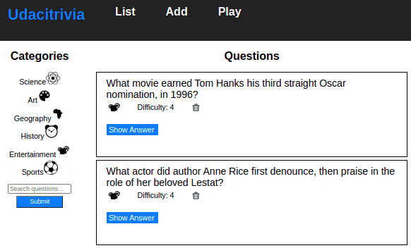

# Trivia RESTful API

RESTful API to play trivia games using Flask, PostgreSQL via SQLAlchemy. Frontend in React.   

## Tech Stack

Besides **Python 3**, here are the other required run components:

### 1. Backend Dependencies

 * **Conda** to manage dependencies
 * **Flask** as the backend server framework
 * **Flask-CORS** to handle cross origin requests from the frontend server
 * **SQLAlchemy ORM** as the ORM library of choice
 * **PostgreSQL** as the database of choice

### 2. Frontend Dependencies

* **Google Chrome** as user interface to display **HTML**, **CSS** and **Javascript**
* **Nodejs** as the frontend server framework
* **NPN** to manage dependencies for the frontend 

## Installing Dependencies
This project depends on Conda for the creation of an environment that isolates the required dependencies from the rest of the system. Before continuing, you should download and install Conda from [https://docs.conda.io/en/latest/miniconda.html](https://docs.conda.io/en/latest/miniconda.html).

After cloning the repo, start by replicating the running environment for the code from the environment.yml file like so:   

```bash
conda env create -f environment.yml
```
Then, to get the frontend dependencies cd to the `/frontend` directory of the project an run:  

```bash
npm install
```

## Local usage:

1. **Configure and start a Postgres server on your local machine:**  
* From within your virtual environment, `cd` to the parent directory of your database cluster folder
* Run `pg_ctl -D my_db_cluster start` to start the database cluster (in this example 'my_db_cluster')
* Run `createdb trivia` to create a database to use for the app
* Run `createdb trivia_test` to create the test database
* Change to your project directory and from there into `/backend`
* Run `psql trivia < trivia.psql` to import the db schema into the main database
* Run `psql trivia_test < trivia.psql` to import the db schema into the test database


3. **Run the backend server:**

From within `/backend` run:  
```
export FLASK_APP=flaskr
export FLASK_ENV=development
flask run --reload
```
4. **Run the frontend server:**

From within `/frontend` run:  

```bash
npm start
```


5. **Verify on the Browser**<br>
Navigate to the Web App homepage [http://127.0.0.1:3000/](http://127.0.0.1:3000/) or [http://localhost:3000](http://localhost:3000)  


**Expected result:**  




## RESTful API documentation

### Endpoints
GET '/api/v1.0/categories'  
GET '/api/v1.0/questions?page=${integer}'  
DELETE '/api/v1.0/questions/<int:question_id>'  
POST '/api/v1.0/questions'  
POST '/api/v1.0/questions/search'  
GET '/api/v1.0/categories/<int:category_id>/questions'  
POST '/api/v1.0/quizzes'  


**GET '/api/v1.0/categories'**
- Description: Fetches a dictionary of categories in which the keys are the ids and the value is the corresponding string of the category
- Request Arguments: None
- Returns: An object with a single key, categories, that contains a object of id: category_string key:value pairs  
```js
{'1' : "Science",
 '2' : "Art",
 '3' : "Geography",
 '4' : "History",
 '5' : "Entertainment",
 '6' : "Sports"}
```

**GET '/api/v1.0/questions?page=${integer}'**
- Description: Fetches a dictionary of all questions (objects) as well as a dictionary of categories in which the keys are the ids and the value is the corresponding string of the category
- Request Arguments: page - integer
- Returns:  an object with the current questions based on the selected page, total questions (integer), an object containing categories, and the current category  
- Example:  
```js
{
    'questions': [
        {
            'id': 1,
            'question': 'This is a question',
            'answer': 'This is an answer',
            'difficulty': 5,
            'category': 2
        }, ...
    ],
    'categories': { '1' : "Science",
                    '2' : "Art",
                    '3' : "Geography",
                    '4' : "History",
                    '5' : "Entertainment",
                    '6' : "Sports" },
    'total_questions': 100,
    'current_category': 'History'
}
```
    
**DELETE '/api/v1.0/questions/<int:question_id>'**
- Description: Deletes a question based on the question id submitted
- Request Arguments: id - integer
- Returns: Does not return anything besides the appropriate HTTP status code


**POST '/api/v1.0/questions'**
- Description: Allows the user to create a new question using the input form
- Request Body:
```js
{
    'question':  'Heres a new question string',
    'answer':  'Heres a new answer string',
    'difficulty': 1,
    'category': 3,
}
```

- Returns: Does not return anything besides the appropriate HTTP status code

**POST '/api/v1.0/questions/search'**
- Description: Fetches a list of questions based on the search criteria submitted.  This is a case-insensitive search with partial string search, meaning that all questions containing the string, regardless of case, will be returned as a paginated list
- Request Body:
```js
{
    'searchTerm': 'this is the term'
}
```

- Returns: any array of questions, a number of totalQuestions that met the search term and the current category string

- Example:  
```js
{
    'questions': [
        {
            'id': 1,
            'question': 'This is a question',
            'answer': 'This is an answer',
            'difficulty': 5,
            'category': 5
        },
    ],
    'total_questions': 100,
    'current_category': 'Entertainment'
}
```

**GET '/categories/<int:category_id>/questions'**
- Description: Fetches a list of questions based on the category passed in
- Request Arguments: id - integer
- Returns: An object with questions for the specified category, total questions, and current category string
- Example:  
```js
{
    'questions': [
        {
            'id': 1,
            'question': 'This is a question',
            'answer': 'This is an answer',
            'difficulty': 5,
            'category': 4
        },
    ],
    'total_questions': 100,
    'current_category': 'History'
}
```

**POST '/api/v1.0/quizzes'**
- Description: Randomly selects a question that belongs to the selected category, and that has not previously been selected.
- Request Body:

```js
{'previous_questions':  an array of question id's such as [1, 4, 20, 15]
'quiz_category': {'type': 'Science', 'id': '1'}}
```

- Returns: A randomly selected question (as an object)
- Example:  
```js
{
    'question': {
        'id': 1,
        'question': 'This is a question',
        'answer': 'This is an answer',
        'difficulty': 5,
        'category': 4
    }
}
```

## Testing
To run the tests, cd into the project's directory, then run:  
```
dropdb trivia_test
createdb trivia_test
psql trivia_test < trivia.psql
python test_flaskr.py
```

## Acknowledgement

Kudos to Udacity for the following create-react-app frontend that accompanies this API:  

https://github.com/udacity/FSND/tree/master/projects/02_trivia_api/starter  

